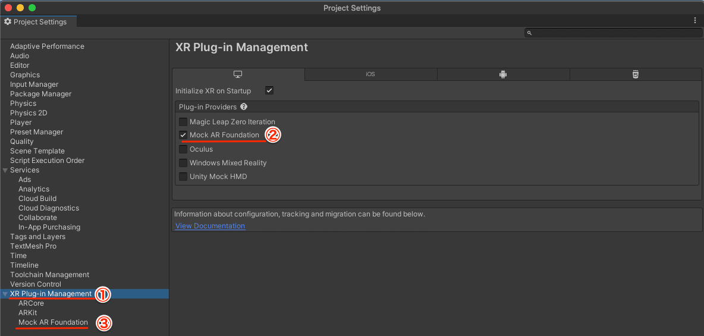
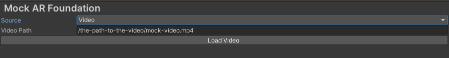
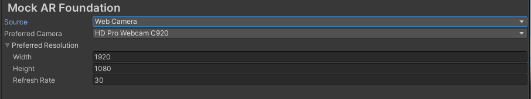

# Mock AR Foundation

Mock AR Foundation is a simple mocking system for AR foundation. It simurates the AR camera in Editor.

## How to install

Add the following git URL from Unity package manager:  
`https://github.com/asus4/mock-arfoundation.git?path=Packages/MockARFoundation#0.2.0`

## How to setup

1. Open Project Settings and select XR Plug-in Management
2. Enable `Mock AR Foundation` in the PC tab
3. Select the specific setting for `Mock AR Foundation`

In the setting: you can select an input source for the AR camera. Currently, a video file or a webcam live input are supported.

